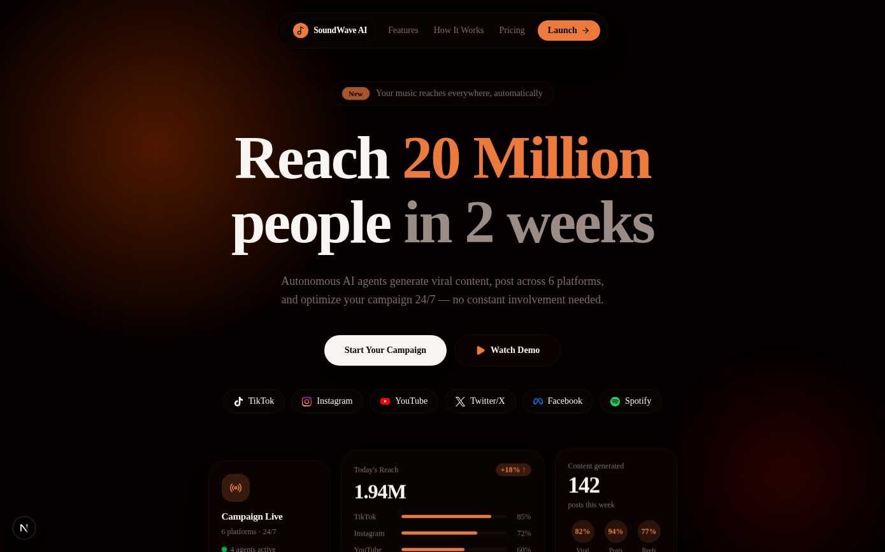

# SoundWave AI — Viral Engine

**Not a marketing tool. A distribution engine. Input one song, get 100+ pieces of platform-optimized content across 6 platforms, built to force algorithm exposure for independent artists.**

[]()
[]()



**Live:** [sound-wave-ai.replit.app](https://sound-wave-ai.replit.app) — a real, launched v1.0 product, not a prototype.

## Overview
Independent artists don't fail because of bad music — they fail from inconsistent posting and inability to produce content volume. SoundWave AI turns one song into dozens of optimized short-form clips and posts, tailored per platform.

## Problem
Independent artists can't manually produce the volume or platform-specific variety of content that algorithm-driven distribution requires.

## Solution
AI content generation, posting, and analytics agents that turn a single song into platform-specific content at scale — explicitly not a scheduling tool (not competing with Hootsuite/Buffer), but a content generation engine.

## Key Capabilities
- AI content generation agent: platform-specific content variations from one song
- AI posting agent: cross-platform distribution
- AI analytics agent: performance tracking feeding back into content strategy
- Full auth system

## Technology Stack

| Layer | Technology |
|---|---|
| Framework | Next.js 16, React 19 |
| Styling | Tailwind CSS v4 |
| Language | TypeScript |
| Database / Auth | Supabase v2 |
| AI SDK | `@ai-sdk/react` |
| ORM | Drizzle |

## Testing / Linting
```bash
npm run lint
npm run build
```
This repo has ESLint configured, unlike most of the portfolio's build-only tier.

## Project Status
Launched — this is a real, live v1.0 product with real users, not a prototype.

## Contributing
Private, proprietary CREOVA product.

## License
Proprietary — All Rights Reserved.

## Author / Organization
Built by [Justin Mafie](https://github.com/creova-gif) under CREOVA.

## Documentation
See `CLAUDE.md` for AI-agent-specific notes.
